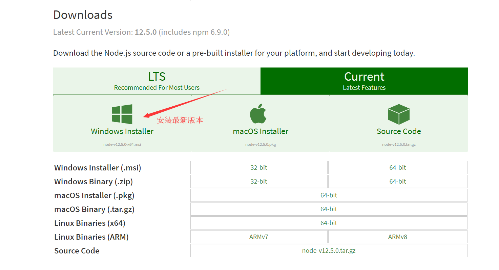

这是我的第一篇个人博客。下面讲述一下，我利用Hexo+github搭建个人博客的历程。网上已经有很多关于Hexo搭建博客的资料了，
比如这一篇博客[Hexo+Github搭建个人博客](https://blog.csdn.net/u014427391/article/details/53670744)
<!-- more -->
## 环境配置
首先，需要安装一大堆东西。主要是安装node.js,然后通过node.js的npm包管理命令安装许多其他的插件。
### nodeJs安装
访问[node.js的官网](https://nodejs.org/en/download/current/)安装node.js，如下图  

### Hexo安装